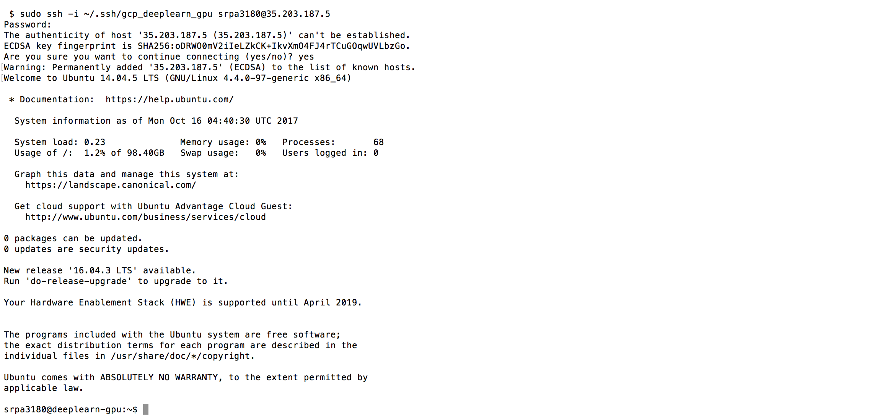
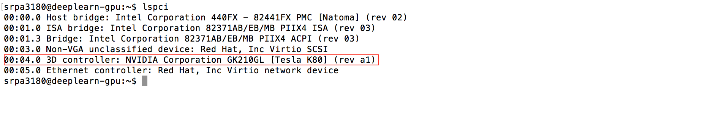
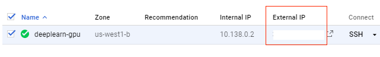
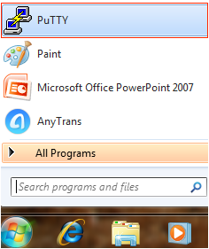
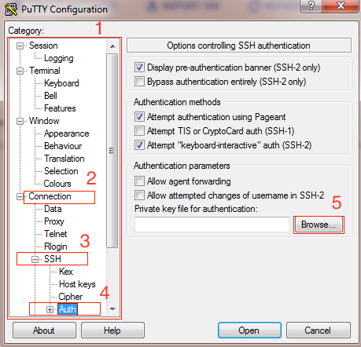
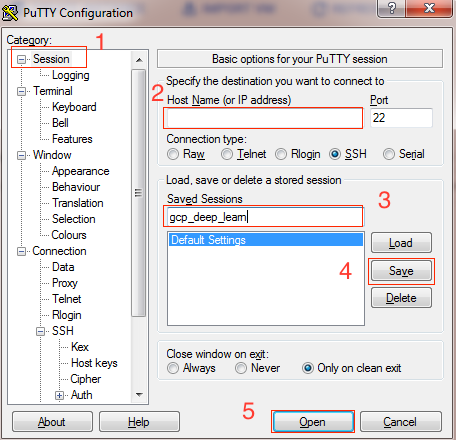
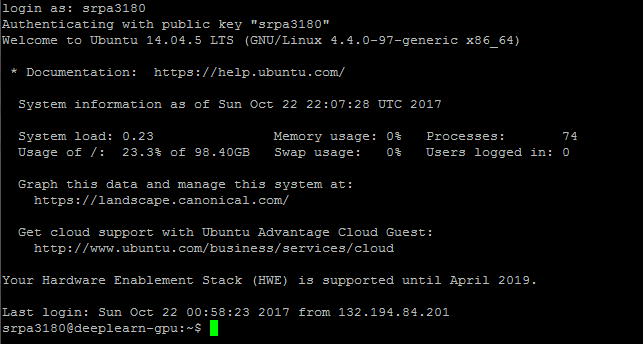

# USING MAC OS or Linux

Open a new terminal.

## Step 1: Using the SSH-Key generated

```
sudo ssh -i ~/.ssh/gcp_deeplearn_gpu srpa3180@35.203.187.5
```

<kbd>
  
</kbd>

## Step 2: Confirm if GPU is attached

```
lspci
```

<kbd>
  
</kbd>

It's recommended that one stops the VM when its not used, as the charge per hour is ~$1. Approx. you can get less than 300 hours with the free credit to play around with a GPU VM on GCP.

# USING Windows

Launch PuTTY

## You can obtain your public IP address by returning to your GCP console.

<kbd>
  
</kbd>

## From the start Menu, search for putty and click 'PuTTY'. 

<kbd>
  
</kbd>

## 1. Scroll down.
## 2. Click 'Connection'
## 3. Click 'SSH'
## 4. Click 'Auth'
## 5. Click 'Browse' and select the private key you save from PuTTYgen, which has a extension '.ppk'


<kbd>
  
</kbd>

## 1. Scroll back up, Click 'Session'
## 2. Enter your public ip address
## 3. name your session
## 4. Click 'Save'
## 5. Start your session by clicking 'Open'

<kbd>
  
</kbd>

## Security Alert
Click 'yes' when prompted to continue.

## Enter your GCP username and hit the 'Enter/return' key to login to your VM

<kbd>
  
</kbd>

 [Back to Main](https://github.com/s3p02/jupyter_gcp_nvidia-docker_digits)
