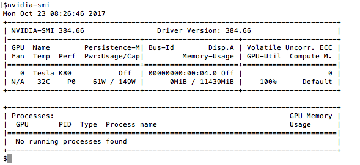

# Docker setup for DIGITS

Check for Nvidia GPU

```
lspci
```

<kbd>
  
</kbd>

# Install Nvidia Drivers & CUDA 8

## Save the following code using vim or nano, name your file [0_install_nvidia_drivers.sh](https://github.com/s3p02/building_digits_on_gcp_docker/blob/master/0_install_nvidia_drivers.sh)

```
#!/bin/bash
echo "Checking for CUDA and installing."
# Check for CUDA and try to install.
if ! dpkg-query -W cuda; then
  curl -O http://developer.download.nvidia.com/compute/cuda/repos/ubuntu1404/x86_64/cuda-repo-ubuntu1404_8.0.61-1_amd64.deb
  dpkg -i ./cuda-repo-ubuntu1404_8.0.61-1_amd64.deb
  apt-get update
  apt-get install cuda -y
  apt-get install linux-headers-$(uname -r) -y
fi
```

## Using 'chmod' change the permissions of this '.sh' file.

```
sudo chmod a+x 0_install_nvidia_drivers.sh
```
## Run the '0_install_nvidia_drivers.sh' file

```
sudo ./0_install_nvidia_drivers.sh 
```
## The Script takes 6-8 minutes, depending on the resources alloted.

## You must export the cuda path to your '.bashrc'.

```
echo 'export PATH=/usr/local/cuda-8.0/bin${PATH:+:${PATH}}' >> ~/.bashrc
echo 'export LD_LIBRARY_PATH=/usr/local/cuda-8.0/lib64\' >> ~/.bashrc
echo '                         ${LD_LIBRARY_PATH:+:${LD_LIBRARY_PATH}}' >> ~/.bashrc
source ~/.bashrc
```
## Check if path has been exported.

```
nvcc --version 
```

<kbd>
  
</kbd>

# Check if NVIDIA Drivers have been installed

```
nvidia-smi
```

<kbd>
  
</kbd>

# Install Dependencies

```
sudo apt-get install --no-install-recommends git graphviz python-dev python-flask python-flaskext.wtf python-gevent python-h5py python-numpy python-pil python-pip python-scipy python-tk
```
## You can save it as a script as well and run [1_install_dependencies.sh](https://github.com/s3p02/building_digits_on_gcp_docker/blob/master/1_install_dependencies.sh) using 'chmod' change the permissions of this '.sh' file.

```
sudo chmod a+x 1_install_dependencies.sh
```
## Run the '1_install_dependencies.sh' file

```
sudo ./1_install_dependencies.sh 
```


# Building using Docker

## For building DIGITS from source, click [here](https://github.com/s3p02/building_digits_on_gcp/blob/master/README.md)

## The most Easiest way to get started with [DIGITS](https://developer.nvidia.com/digits) is using [NVIDIA-Docker](https://hub.docker.com/r/nvidia/digits/tags/).

# Step 1: Install Docker

 Worth doing the following one by one.

## Remove any existing docker files, if any.

```
sudo apt-get remove docker docker-engine docker.io
```

## Update System Packages

```
sudo apt-get update
```


```
sudo apt-get install \
    linux-image-extra-$(uname -r) \
    linux-image-extra-virtual
```

```
sudo apt-get update
```


```
sudo apt-get install \
    apt-transport-https \
    ca-certificates \
    curl \
    software-properties-common
```


```
curl -fsSL https://download.docker.com/linux/ubuntu/gpg | sudo apt-key add -
```


```
sudo add-apt-repository \
   "deb [arch=amd64] https://download.docker.com/linux/ubuntu \
   $(lsb_release -cs) \
   stable"
```


```
sudo apt-get update
```


```
sudo apt-get install docker-ce
```


```
sudo docker run hello-world
```

# Step 2 : Install NVIDIA-Docker


```
wget https://github.com/NVIDIA/nvidia-docker/releases/download/v1.0.1/nvidia-docker_1.0.1-1_amd64.deb
```

```
sudo dpkg -i nvidia-docker_1.0.1-1_amd64.deb
```
## Verify installation

```
sudo nvidia-docker run hello-world
```

# Step 2 : Pull DIGITS 5.0


```
sudo docker pull nvidia/digits
```

# Step 3 : Run DIGITS 5.0 using NVIDIA-Docker


```
sudo nvidia-docker run --name name_your_docker_container -d -p 5000:5000 -v $(pwd):/home/$USER nvidia/digits
```

curl is a tool to transfer data from or to a server, using one of the supported protocols (DICT, FILE, FTP, FTPS, GOPHER, HTTP, HTTPS, IMAP, IMAPS, LDAP, LDAPS, POP3, POP3S, RTMP, RTSP, SCP, SFTP, SMB, SMBS, SMTP, SMTPS, TELNET and TFTP). The command is designed to work without user [interaction](https://curl.haxx.se/docs/manpage.html).

```
curl localhost:5000/index.json
```


## The following response indicates that digits is running on 'localhost:5000'

<kbd>
  
</kbd>

 [Back to Main](https://github.com/s3p02/jupyter_gcp_nvidia-docker_digits)
