# DIGITS access through jupyter.

## Step i : Interact with the DIGITS Docker Container using Jupyter


```
jupyter notebook --no-browser --port=8889
```
Save/copy the token presented.

<kbd>
  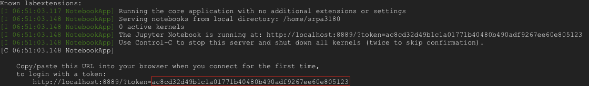
</kbd>


## Step ii : Port Forward on Local System

If your local machine is running linux/mac os, run the following by for [port forwarding](https://help.ubuntu.com/community/SSH/OpenSSH/PortForwarding). 

```
ssh -i ~/.ssh/gcp_new -N -f -L localhost:8888:localhost:8889 __user__name__@__external__ip__address
```

Say 'yes' for ECDSA key fingerprint.

## Step iii : Launch Jupyter Notebook on Local System

Open a web-browser and go to [localhost:8888](localhost:8888)


## Enter the token, and click 'Login'

<kbd>
  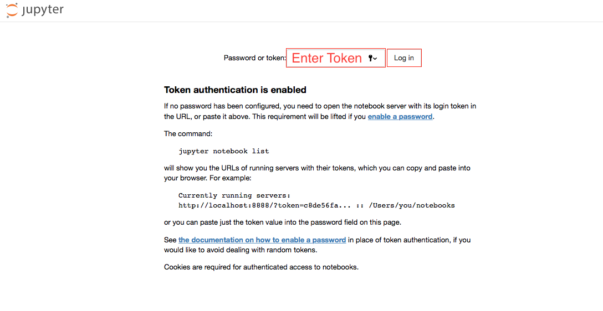
</kbd>

## You will enter the jupyter notebook dashboard.

<kbd>
  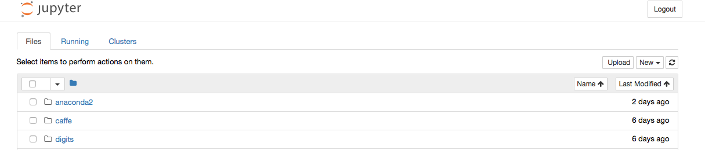
</kbd>

## Click the New dropdown menu and seleck Python 2 Notebook.

<kbd>
  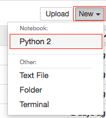
</kbd>

## Enter the following in the new notebook.

```
!curl localhost:5000/index.json
```

## The following response indicates that digits is running on 'localhost:5000'

<kbd>
  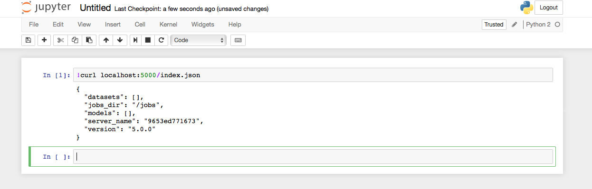
</kbd>


Thw whole notion of using the curl command is to use the NVIDIA DIGITS [REST](https://en.wikipedia.org/wiki/Representational_state_transfer) [API](https://en.wikipedia.org/wiki/Application_programming_interface) (Application Programming Interface). We shall use this API for self-contained, stateless queries in order to create datasets and models, retrieve job information and perform inference on a trained model. This interface is easily scriptable, using python as well.

In this tutorial as we walk-through we will see how the API may be used to create an image classification model. As we initialized the docker container, we specified the port 5000 so we will be assuming DIGITS is running on localhost:5000


## Step iv : Login to DIGITS

In order to create a dataset, you will first need to log in. The following command will log us in as user, you may enter your name.

```
!curl localhost:5000/login -c digits.cookie -XPOST -F username=user
```

<kbd>
  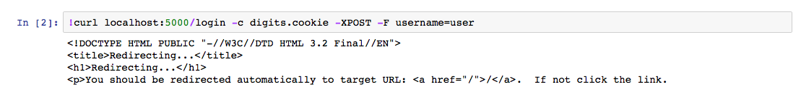
</kbd>

The -c digits.cookie flag instructs curl to store the [session cookie](https://en.wikipedia.org/wiki/HTTP_cookie) into digits.cookie. DIGITS requires users to log in before creating jobs. A job can only be edited or deleted by the user that created it. The session cookie is required for all commands that create or modify jobs. For those commands we will use -b digits.cookie in the curl command line to pass the session cookie to DIGITS.

## Step v : Creating a Dataset

[Open Images](https://github.com/openimages/dataset) is a dataset of ~9 million URLs to images that have been annotated with image-level labels and bounding boxes spanning thousands of classes. However, for our dataset, we shall use google's creative-commons licensed flower photos. Enter the following to download the dataset:

```
!curl http://download.tensorflow.org/example_images/flower_photos.tgz \
    | tar xz -C ~/
```

<kbd>
  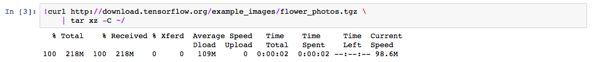
</kbd>


## Check for dataset

```
!ls ~/flower_photos
```

## Our dataset consists of 5 classes, with each class having >500 images.

<kbd>
  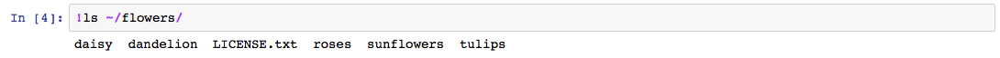
</kbd>

## Set Path to create Dataset

```
FLOWER_PHOTO_PATH='/home/srpa3180/flower_photos/'
```

```
!curl localhost:5000/datasets/images/classification.json -b digits.cookie -XPOST -F folder_train=$FLOWER_PHOTO_PATH -F encoding=jpg -F resize_channels=1 -F resize_width=240 -F resize_height=240 -F method=folder -F dataset_name=google_flowers_dataset
```


To know more about how we set the value of various fields in the dataset creation form, using the REST API, please refer to Nvidia's comprehensive list of the available form fields in [forms.py](https://github.com/NVIDIA/DIGITS/blob/master/digits/dataset/images/classification/forms.py)

## The Following indicates that the dataset in initialized

<kbd>
  
</kbd>

## Its Important we note down the dataset id as shown from the above response

```
!curl localhost:5000/datasets/20171024-072846-e9f2/status
```
## The Following indicates the status of the dataset, "done".

<kbd>
  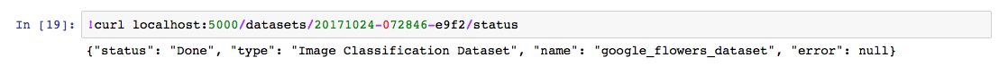
</kbd>

```
!curl localhost:5000/datasets/20171024-072846-e9f2.json
```
## To get a detailed description of the dataset, we can call the json using the dataset ID.

<kbd>
  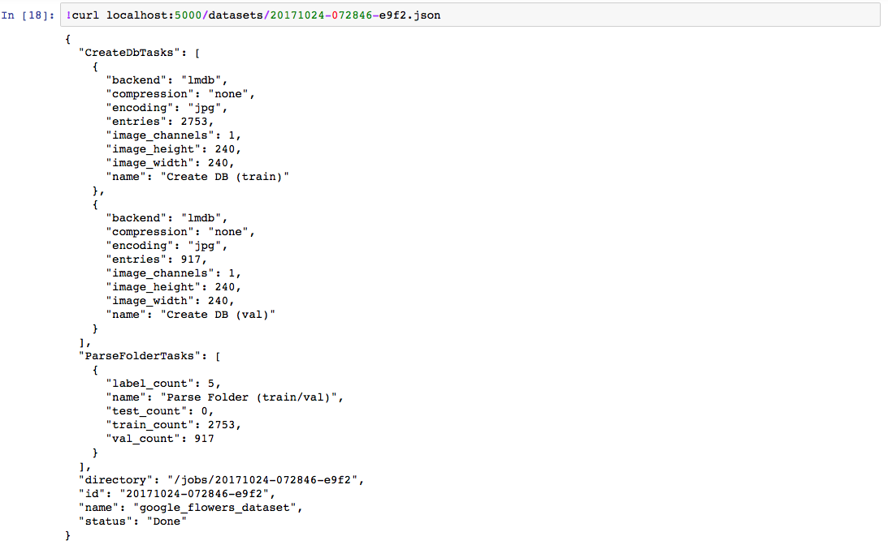
</kbd>

## Its Important we note down the dataset id as shown from the above response

## Step vi : Creating a caffe Model

For creating our model, we shall run the following.

```
!curl localhost:5000/models/images/classification.json -b digits.cookie -XPOST -F model_name=google_flowers_model -F dataset=20171024-072846-e9f2 -F method=standard -F standard_networks=googlenet -F train_epochs=30 -F framework=caffe 
```
## The Following indicates that the model is initialized

<kbd>
  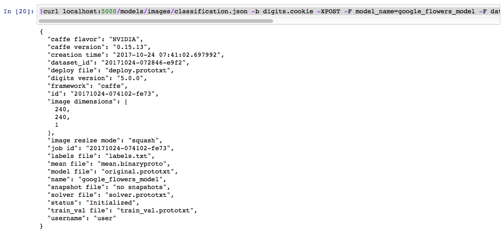
</kbd>

## Its Important we note down the JOB ID of our model as shown from the above response

```
!curl localhost:5000/models/20171024-074102-fe73/status
```

## The Following indicates the status of the model, "running".

<kbd>
  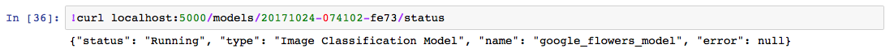
</kbd>

```
!curl localhost:5000/models/20171024-074102-fe73.json
```
## To get a detailed description of the model, we can call the json using the JOB ID.

<kbd>
  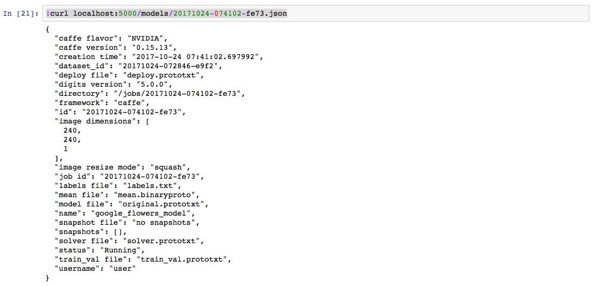
</kbd>

## Its Important we note down the JOB ID as shown from the above response

##

```
!nvidia-smi
```
## To get check on GPU utilization and Memory, we can call the above command, which shows the below description.

<kbd>
  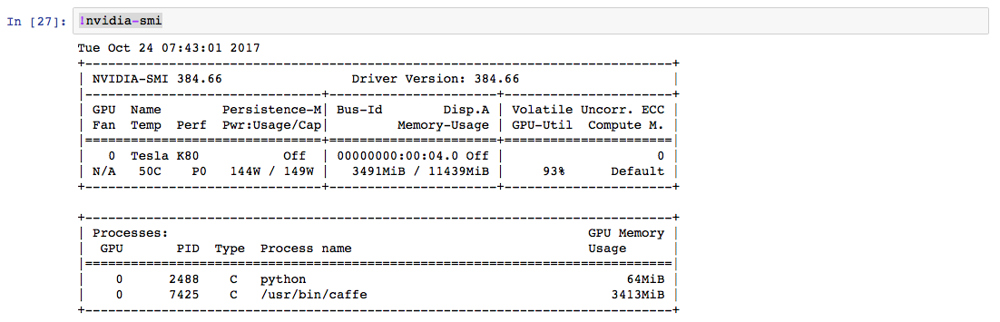
</kbd>


```
!curl localhost:5000/models/20171024-074102-fe73.json
```

## To check on number of epoch's completed we call the description of the model through the json, which shows "snapshots" as 1, indicationg the completion of 1 epoch as shown below.

<kbd>
  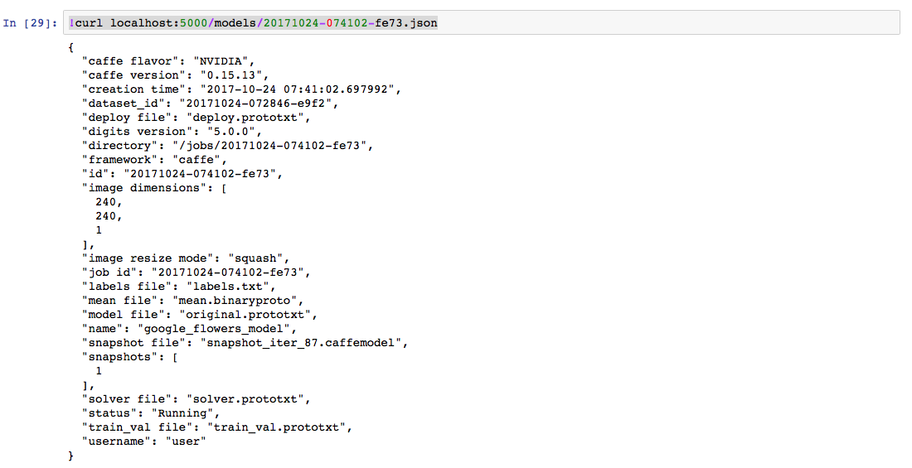
</kbd>

##

```
!wget https://upload.wikimedia.org/wikipedia/commons/thumb/7/7b/Yonina_Tulip.jpg/220px-Yonina_Tulip.jpg -P ~/
```

## To check for accuracy of our running model, we first download a smaple test image from wikipidia, as shown below.

<kbd>
  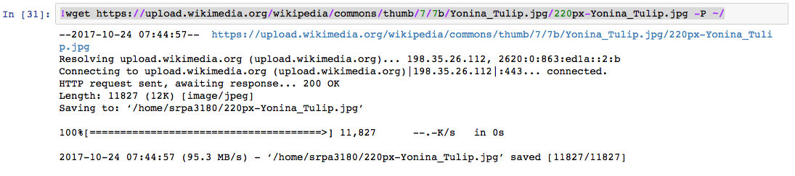
</kbd>

##

```
!curl localhost:5000/models/images/classification/classify_one.json -XPOST -F job_id=20171024-074102-fe73 -F image_file=@/home/srpa3180/220px-Yonina_Tulip.jpg
```

## To test for accuracy of our running model, we run the above, which returns a json as shown below.

<kbd>
  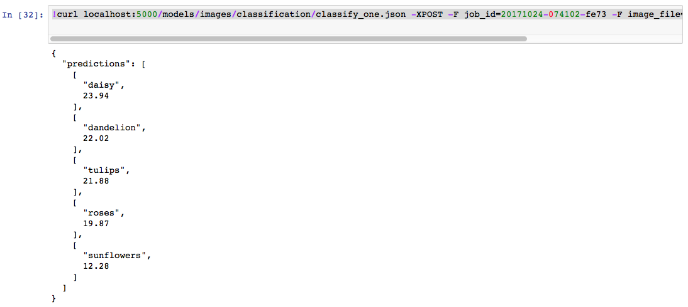
</kbd>

##

```
!curl localhost:5000/models/images/classification/classify_one.json -XPOST -F job_id=20171024-074102-fe73 -F image_file=@/home/srpa3180/220px-Yonina_Tulip.jpg
```

## To test for accuracy of our running model, we run the above, which returns a json as shown below.

<kbd>
  
</kbd>

## We notice that the prediction is poor, however the prediction get better with future epochs.

```
!curl localhost:5000/models/20171024-074102-fe73.json
```

## As the Epochs increase, the predictions may get better as shown below.

<kbd>
  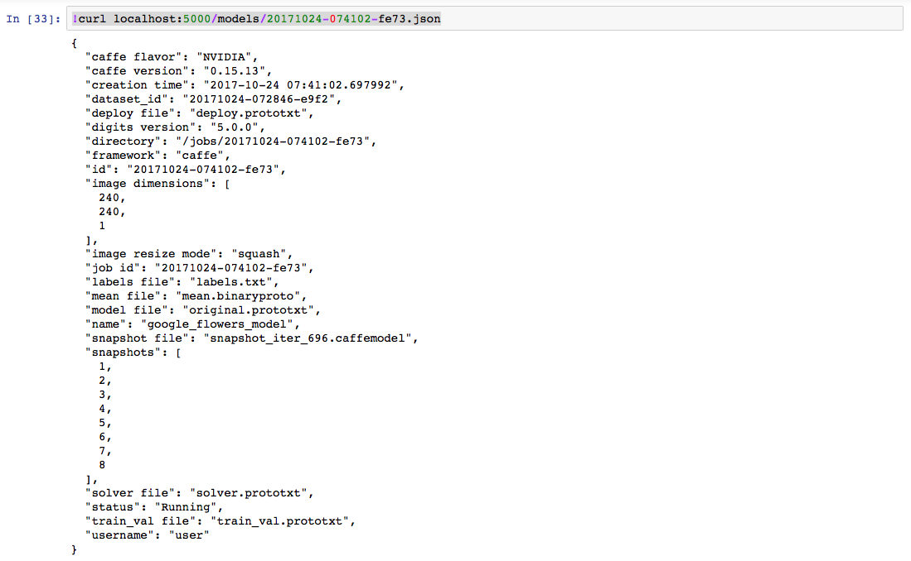
</kbd>

###

```
!curl localhost:5000/models/images/classification/classify_one.json -XPOST -F job_id=20171024-074102-fe73 -F image_file=@/home/srpa3180/220px-Yonina_Tulip.jpg
```

## To test for accuracy of our running model, we run the above, which returns a json as shown below.

<kbd>
  
</kbd>


##
```
!curl localhost:5000/models/20171024-074102-fe73.json
```

## As the Epoch reaches 30, the json, which shows "snapshots" as 1, indicates the completion of 30 epoch as shown below.

<kbd>
  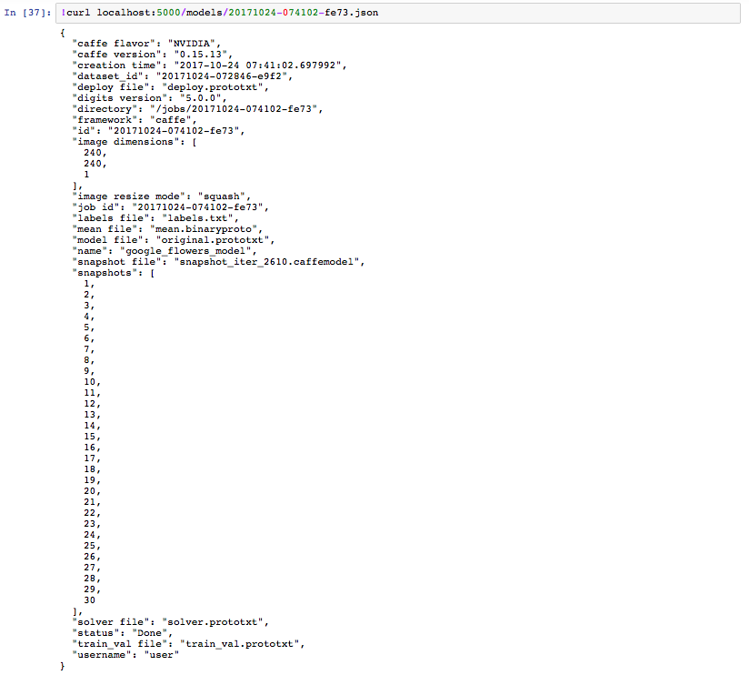
</kbd>


## Step vii : Download model from docker container

```
def download_caffe_model(dataset_id,job_id,dir_name,docker_container_name):
    dataset_id_path='jobs/'+dataset_id
    job_id_path='jobs/'+job_id
    d_ir='~/'+dir_name
    !mkdir $d_ir
    d_ir_temp=d_ir+'_temp'
    !mkdir $d_ir_temp
    !sudo nvidia-docker cp $docker_container_name:$dataset_id_path $d_ir_temp
    !sudo nvidia-docker cp $docker_container_name:$job_id_path $d_ir_temp
    !sudo ls -tr $d_ir_temp/$job_id/*.caffemodel
    caffe_model_selection=raw_input()
    if (str(caffe_model_selection)==str('all') or str(caffe_model_selection)==str('ALL')):
        !sudo cp $d_ir_temp/$job_id/*.caffemodel $d_ir
        !sudo cp $d_ir_temp/$job_id/caffe_output.log $d_ir
    else:
        
        !sudo cp $caffe_model_selection $d_ir
    !sudo cp $d_ir_temp/$dataset_id/labels.txt $d_ir
    !sudo cp $d_ir_temp/$dataset_id/mean.binaryproto $d_ir
    !sudo cp $d_ir_temp/$job_id/deploy.prototxt $d_ir
    !sudo cp $d_ir_temp/$job_id/original.prototxt $d_ir
    !sudo cp $d_ir_temp/$job_id/solver.prototxt $d_ir
    !sudo cp $d_ir_temp/$job_id/train_val.prototxt $d_ir
    !sudo rm -rf $d_ir_temp/
```
This is a function aimed to perform in jupyter environment.

# Run the above function

Note '20171024-072846-e9f2' is the Dataset ID, '20171024-074102-fe73' is the Model Job ID, 'flower_model' is what I've named my model to be saved as, you can name it as you please and 'name_your_docker_container' is the name of your docker container. To obtain name of docker container run '!sudo nvidia-docker ps'

```
download_caffe_model('20171024-072846-e9f2','20171024-074102-fe73','flower_model','name_your_docker_container')
```

# You will be prompted for an input, either enter one among the shown path's (Iterations are in Ascending order, Epoch 1 is the top one and Epoch 30 is the last one at the bottom) or if you want all iterations with the caffe log enter 'all'

<kbd>
  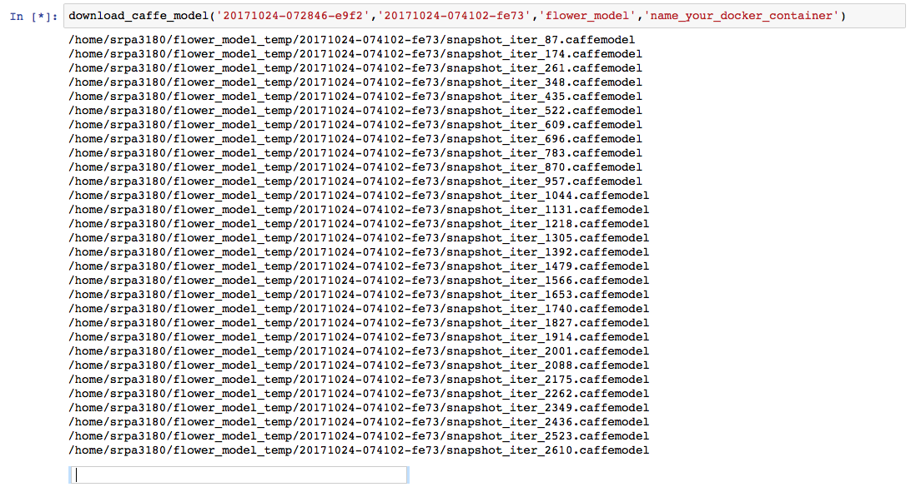
</kbd>

# Your model will be saved in '~/' followed by what you've called your model to be saved as which is the home directory of the VM.

```
!ls ~/flower_model
```

<kbd>
  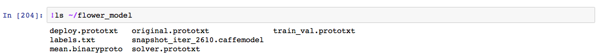
</kbd>


 [Back to Main](https://github.com/s3p02/jupyter_gcp_nvidia-docker_digits)
