# An alternative access to DIGITS, using the web-interface. 

## Step i : Download Dataset

Once you have the digits docker container up and running, at your terminal, enter the following to download the dataset. [Open Images](https://github.com/openimages/dataset) is a dataset of ~9 million URLs to images that have been annotated with image-level labels and bounding boxes spanning thousands of classes. However, for our dataset, we shall use google's creative-commons licensed flower photos.

```
!curl http://download.tensorflow.org/example_images/flower_photos.tgz \
    | tar xz -C ~/
```
 Your Dataset is located in your home directory. 
 
 We need a sample test images to test our dataset while the model is running, so download a smaple test image from wikipidia, as shown below.
 
 ```
!wget https://upload.wikimedia.org/wikipedia/commons/thumb/7/7b/Yonina_Tulip.jpg/220px-Yonina_Tulip.jpg -P ~/
```

Your Sample test image will also be in your home directory
 
Now open a web-browser

## Step ii : Access the web-app

In your web browser, enter http://__YOUR__EXTERNAL__IP__ADDRESS__:5000/	


<kbd>
  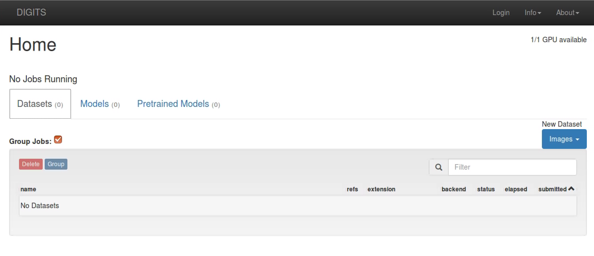
</kbd>

You will see the DIGITS webpage as shown above.

## Step iii : Create a Dataset

Click Images>>Classification under 'New Dataset' as shown below:

<kbd>
  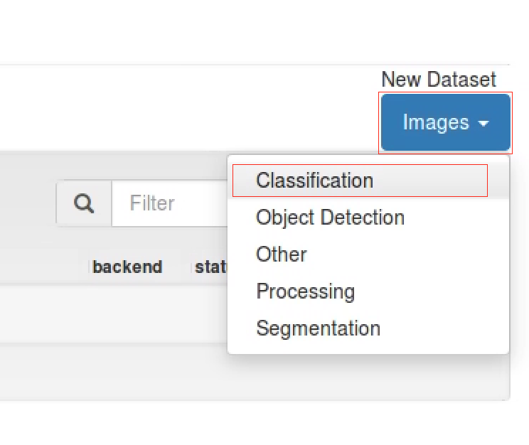
</kbd>

In order to use DIGITS to create models and dataset's one needs to have a username to login. Enter your name. Given that Multiple users can access the same server, username isolates their usage i.e. creating models, and datasets from other accounts.


<kbd>
  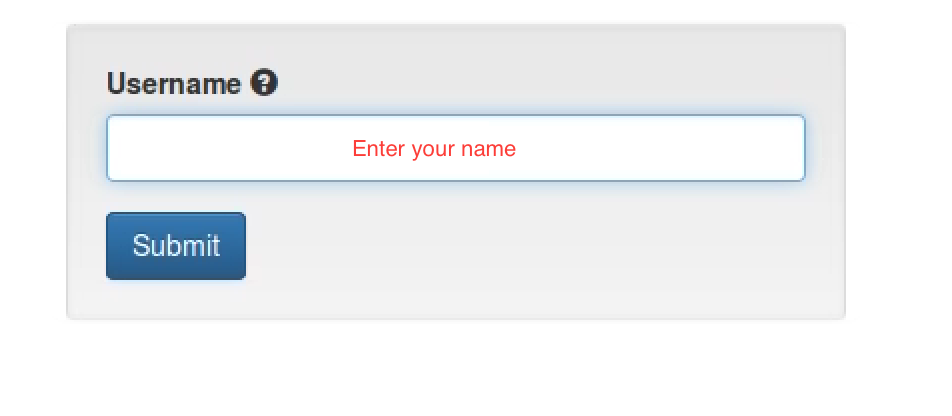
</kbd>

Once your at the 'New Image Classification Dataset' page, Fill in the following :

## 1. Image size 240x240
## 2. Path to our dataset, in my case it is '/home/srpa3180/flowers/' your's would be '/home/__GCP__USERNAME__/flowers/'
## 3. Name your dataset, assign a group
## 4. Click create 


<kbd>
  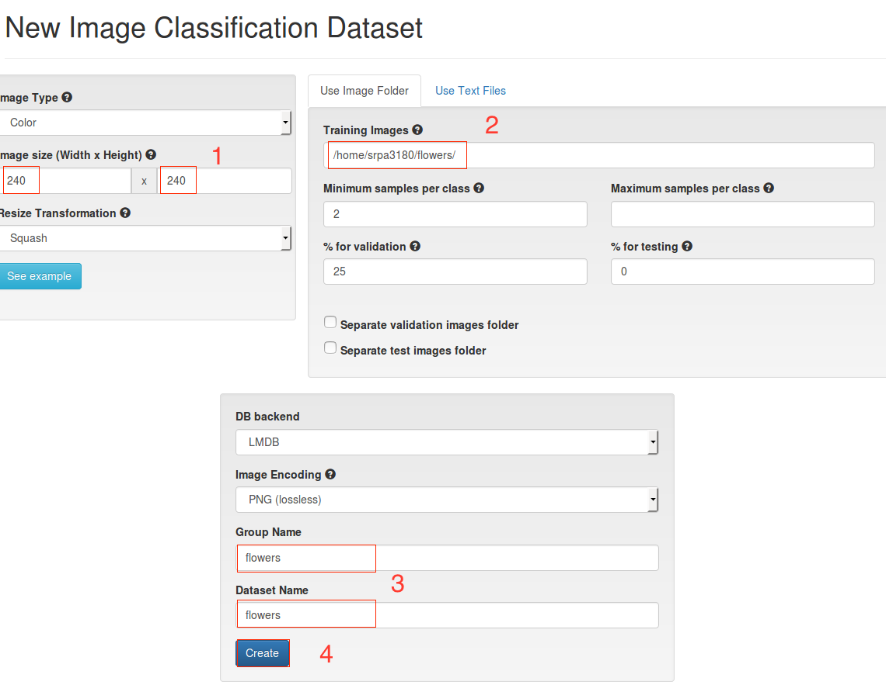
</kbd>

Once you hit create, the page refreshes to a visual representation of our dataset being created. 

<kbd>
  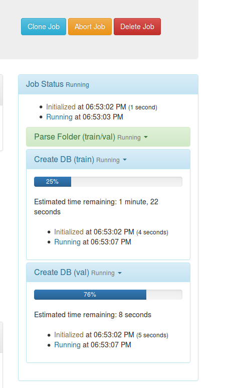
</kbd>

## Step iv : Create Model

Navigate to DIGITS home page by clicking on DIGITS on the left corner of the screen.

<kbd>
  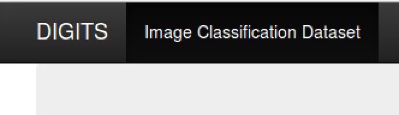
</kbd>

For Models, Click Images>>Classification under 'New Model' as shown below:

<kbd>
  
</kbd>

Once your at the 'New Image Classification Model' page, Fill in the following :

## 1. Select the flowers dataset we previously created
## 2. We run 30 [Epochs](https://deeplearning4j.org/glossary). An Epoch is a complete pass through all the training data. A neural network is trained until the error rate is acceptable, and this will often take multiple passes through the complete data set.

<kbd>
  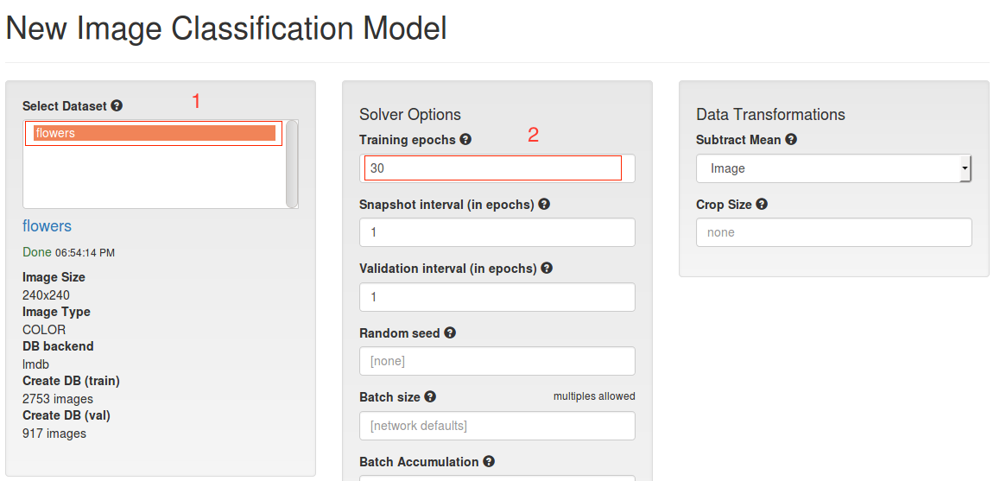
</kbd>

## 3. Scroll down to select a standard network. We shall use [Caffe](http://caffe.berkeleyvision.org) [Deeplearning](https://en.wikipedia.org/wiki/Deep_learning) Framework on [GoogLeNet](https://leonardoaraujosantos.gitbooks.io/artificial-inteligence/content/googlenet.html) Network.

<kbd>
  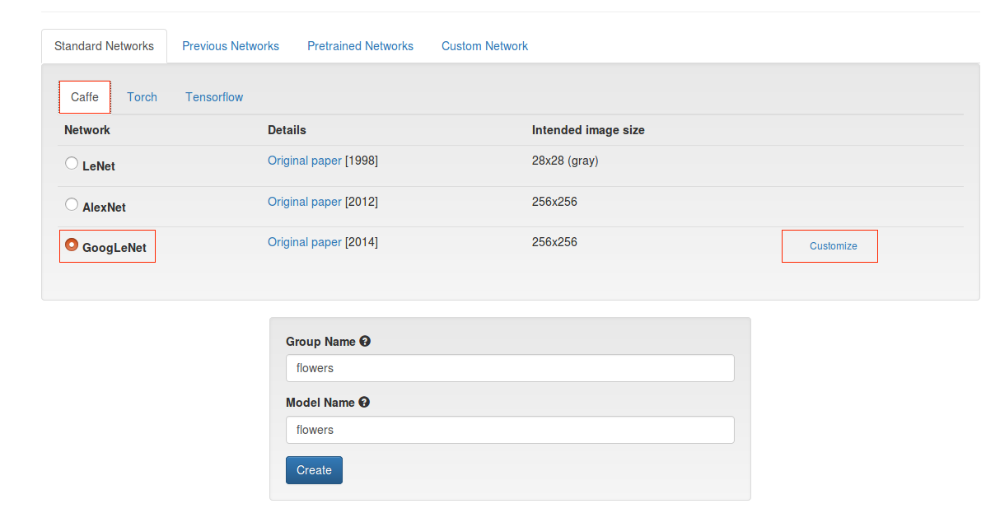
</kbd>

You may choose a network and customize it if you like.

<kbd>
  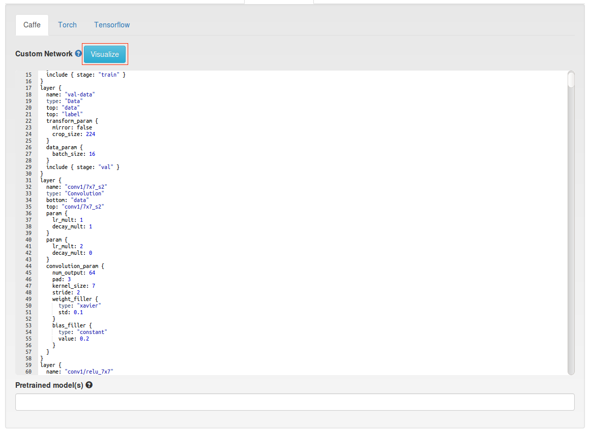
</kbd>

You may visualize the network if you like.

<kbd>
  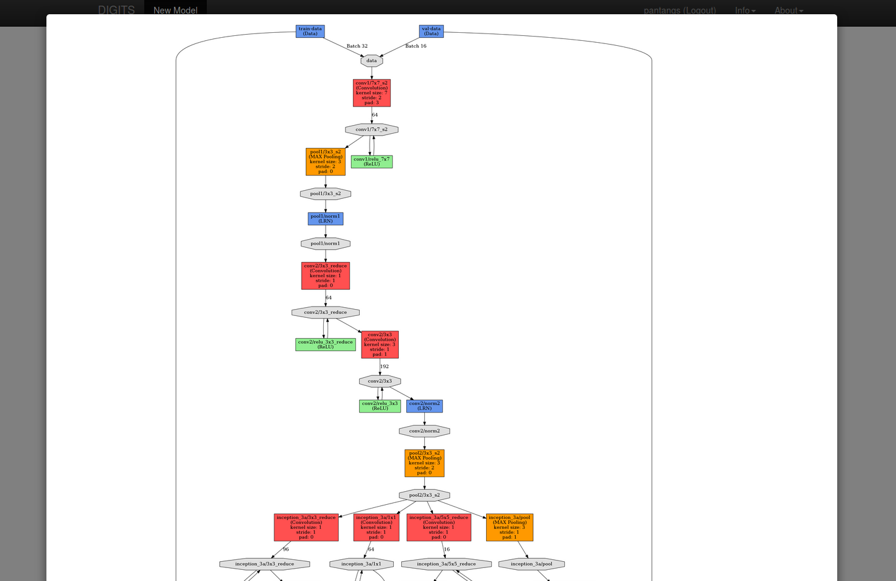
</kbd>

Name your model and group.

<kbd>
  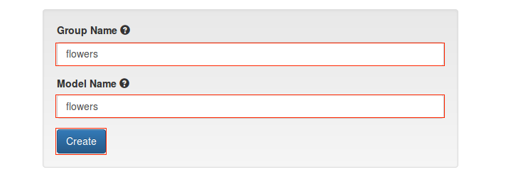
</kbd>

Once your model is initialized, you see its progress.

<kbd>
  
</kbd>

We can Test our models as it run each Epoch. Scroll Down and enter the path to test image ''

<kbd>
  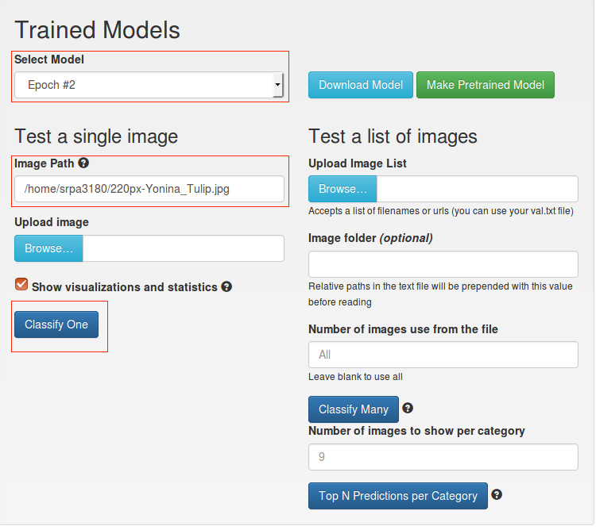
</kbd>

Our accuracy is less at early stages, I tested mine at Epoch 2. It improves over each Epoch, but just increasing the number Epochs never assures better accuracy. DIGITS saves each epoch so you can test each one by selecting it through the dropdown menu.

<kbd>
  
</kbd>

Once the model is complete, you can download by selecting the particular epoch.

<kbd>
  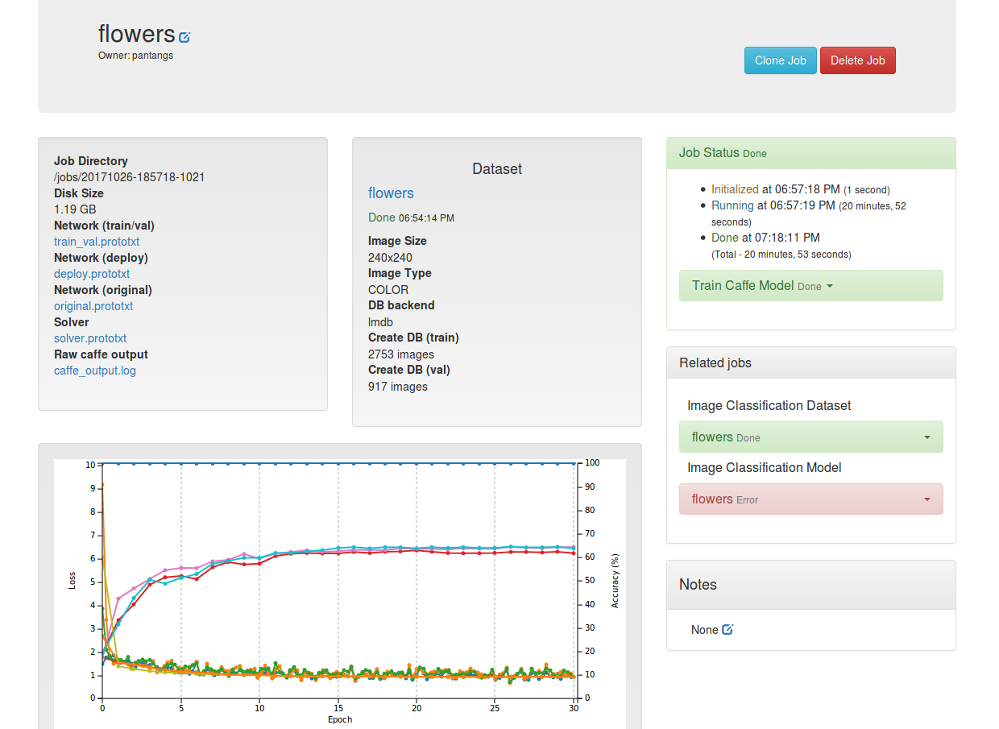
</kbd>

The download is a tar ball, which you can extract and deploy.

<kbd>
  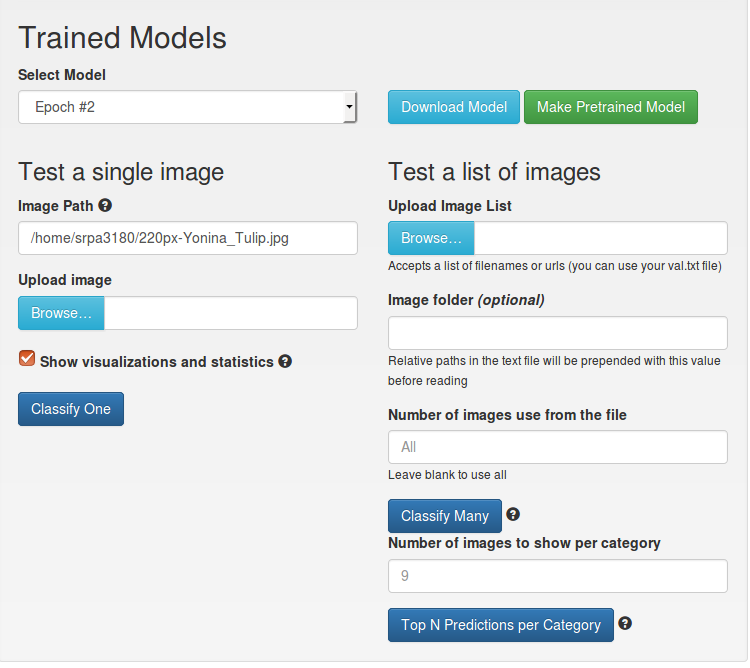
</kbd>


Stop the VM when not in use. You will be charged immediately once you run out of free credits. It's highly recommended that one stop's the VM when it's not being utilized, as the charge per hour is ~$1. Approx. you can get less than 300 hours with the free credit to play around with a GPU VM on GCP.


I humbly thank [Dr. Dan Connors](http://ecee.colorado.edu/~dconnors/index.html) for all his support and guidance while preparing this tutorial.

 [Back to Main](https://github.com/s3p02/jupyter_gcp_nvidia-docker_digits)
