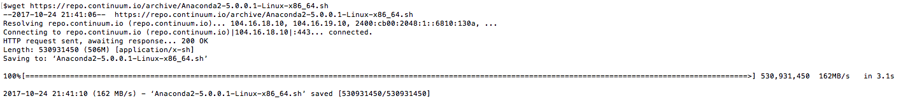
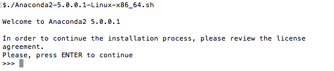
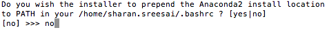
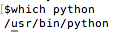
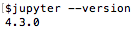

# Jupyter Installation Notebook

## Step 1 : Download Anaconda Python 2.7

```
wget https://repo.continuum.io/archive/Anaconda2-5.0.0.1-Linux-x86_64.sh
```

<kbd>
  
</kbd>

## Step 2 : Run Install file

```
sudo chmod a+x Anaconda2-5.0.0.1-Linux-x86_64.sh
```

```
./Anaconda2-5.0.0.1-Linux-x86_64.sh
```

<kbd>
  
</kbd>

Hit enter, accept licence terms typing 'yes', confirm location hit enter, finally say no to prepend the Anaconda2 install location to PATH.

<kbd>
  
</kbd>

## Step 3 : Recheck python path

```
which python
```
Ensure that the installer has not changed your python path.

<kbd>
  
</kbd>

## Step 4 : Add jupyter to .bashrc

```
echo 'alias jupyter=/home/sharan.sreesai/anaconda2/bin/jupyter' >> ~/.bashrc
source ~/.bashrc
```

## Verify jupyter version

```
source ~/.bashrc
```

<kbd>
  
</kbd>


 [Back to Main](https://github.com/s3p02/jupyter_gcp_nvidia-docker_digits)
